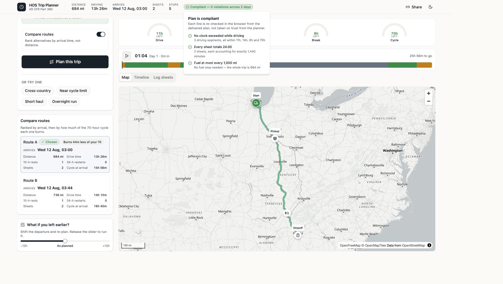
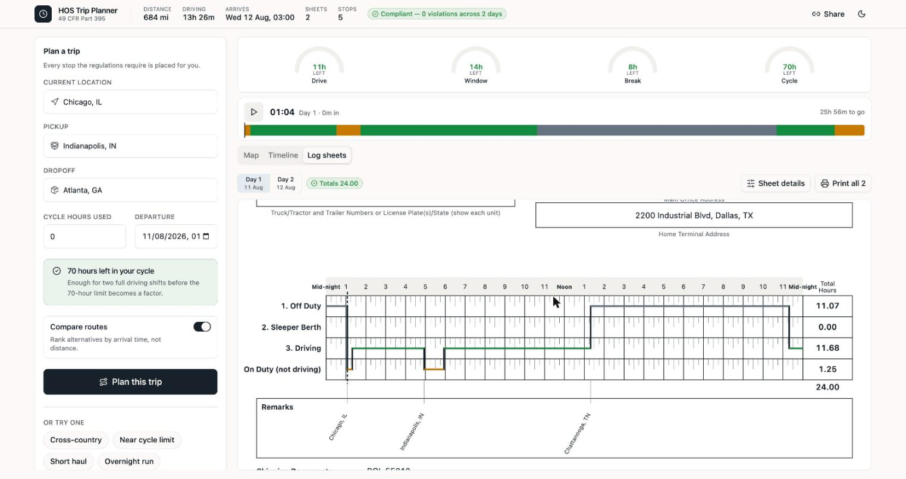

# Cadence

Plan a truck trip that stays inside FMCSA Hours of Service (49 CFR Part 395), and get the driver's daily log sheets for it.

Four inputs — current location, pickup, dropoff, cycle hours already used — and it returns the route with every legally required stop on it, plus a filled-in log for each calendar day.

[](https://github.com/SaadNiaziDev/Cadence/actions/workflows/ci.yml)

> **Live app:** [fmcsa-hos-builder.vercel.app](https://fmcsa-hos-builder.vercel.app/)  
> **Walkthrough:** _add the Loom URL_





---

## The four clocks

A property-carrying driver runs four limits at once. Whichever hits first stops the truck.

| Clock | Limit | Resets on |
| --- | --- | --- |
| **Driving** | 11 h behind the wheel | 10 consecutive hours off duty |
| **Window** | no driving after 14 h from the first minute of work — breaks do not pause it | 10 consecutive hours off duty |
| **Break** | no driving past 8 h of cumulative driving | any 30 consecutive minutes *not* driving |
| **Cycle** | 70 h on duty in a rolling 8 days | days aging out, or 34 consecutive hours off |

Two things most planners get wrong, and this one does not:

- After 14 hours you may still **work** — you just may not **drive**. Loading still burns the 70-hour cycle.
- A 1-hour pickup already satisfies the 30-minute break. Since 2020, on-duty-not-driving counts. Stacking a separate break after loading is legally wrong, not just redundant.

---

## What it does

- **Four gauges, one scrubber.** Play the trip: the truck moves, the gauges drain, the timeline follows, and the log sheet turns the page. Each gauge reads the engine's own snapshot, so the display cannot disagree with the plan.
- **Every stop explains itself.** Click it and it names the rule, cites the section, and says what happens if you ignore it.
- **A warning before you plan.** Type 68 cycle hours and it tells you the trip has to open with a 34-hour restart — while you can still change your mind.
- **Routes ranked by HOS cost**, not miles. A longer road can arrive sooner by finishing a leg before the 14-hour window shuts.
- **Real log sheets.** Traced from the FMCSA form: 24-hour grid, 15-minute ticks, duty line, remarks with real place names, recap. Print gives one sheet per page.
- **A shareable URL** for every plan. Open it in another browser and the full app loads, not a screenshot.

The finished plan is re-checked in the browser: no clock exceeded while driving, every sheet totals 24.00, fuel at most every 1,000 miles.

---

## How the engine works

`backend/trips/services/hos_engine.py` is a pure function — no HTTP, no database. At each step it asks how far the driver may legally go, as the **minimum** of: driving time left, window left, time until a break is due, cycle left, miles to the next fuel stop, and miles to the next waypoint. It drives exactly that far, then inserts whichever rule bound it.

Every segment carries `clocks_after` (what the gauges draw) and a rule id (what the popovers look up). Times are integer minutes end to end, so every sheet is exactly 1,440 minutes rather than 23.99.

`log_builder.py` splits at every midnight, and the split **loops** — a 34-hour restart crosses two midnights, and splitting once would dump more than a day onto one sheet.

```bash
pnpm test    # 147 tests
```

The cases that matter: pickup satisfies the break, a restart spanning two midnights still leaves every sheet complete, hours age out of the rolling 8-day window, and no generated plan ever drives through a clock. Hand-checkable versions of the same claims are in [`docs/VERIFICATION.md`](docs/VERIFICATION.md).

---

## Running locally

Python 3.13 and Node 20+ with pnpm.

```bash
pnpm install     # root tooling
pnpm setup       # backend venv, both dependency sets, migrations
pnpm dev         # API on :8000, app on :3000
```

Open [http://localhost:3000](http://localhost:3000). Copy `backend/.env.example` to `backend/.env` and set `UPSTREAM_USER_AGENT` to a real contact address — Nominatim requires it.

| Script | Does |
| --- | --- |
| `pnpm dev` | API and web together |
| `pnpm test` | Backend suite (147 tests) |
| `pnpm lint` | Frontend lint |
| `pnpm build` | Frontend production build |

---

## Stack

Django 5 + DRF · React 18 + TypeScript + Tailwind + shadcn/ui · MapLibre GL with OpenFreeMap tiles · OSRM routing · Nominatim geocoding. No paid APIs, no API keys.

```
backend/    HOS engine, log builder, routing, geocoding
frontend/   map, gauges, scrubber, timeline, log sheets
```

Every upstream URL is an environment variable. Pointing at a self-hosted OSRM with a truck profile is a config change, not a rewrite. Responses are cached; if a public demo server is down, the app falls back to an offline city table and a straight-line estimate instead of going blank.

**Frontend → Vercel.** `vercel.json` builds the SPA and proxies `/api/*` to the backend.  
**Backend → Railway.** `backend/railway.json` pins build, migrate, and start. Needs `DJANGO_SECRET_KEY`, `DJANGO_DEBUG=false`, `UPSTREAM_USER_AGENT`, and `DATABASE_URL`.

---

## What it does not do

These are assignment limits, not forgotten features:

- **Car routing, not truck-legal.** OSRM ignores bridge heights, weight limits and HGV bans.
- **No sleeper-berth split.** Only plain 10-hour resets.
- **One timezone** — home-terminal time throughout, as §395.8 requires for the sheet.
- **No traffic model** — constant speed within a leg, from the router.
- **Cycle hours are a single total.** The brief gives one number, not a week of prior logs, so the recap cannot split last-7-days from last-8. A production app would recap from the driver's trip history, which would also let departure timing change which hours age out.
- **PDF is the print dialog.** Print all → one sheet per page → Save as PDF.

---

Map tiles © [OpenFreeMap](https://openfreemap.org) © [OpenMapTiles](https://openmaptiles.org), data from [OpenStreetMap](https://www.openstreetmap.org/copyright). Routing by [OSRM](https://project-osrm.org), geocoding by [Nominatim](https://nominatim.org).
